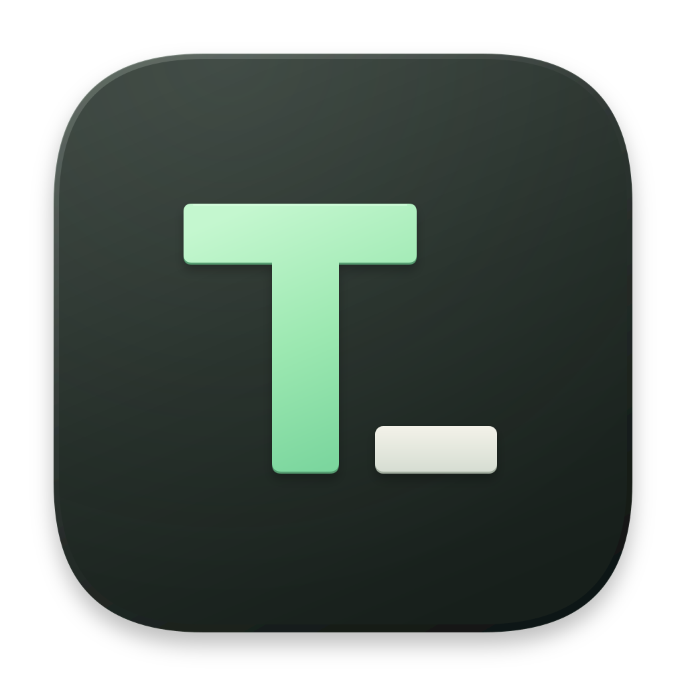

<div align="center">



# XTools

**一个聚合各种实用小工具的开源 macOS 应用**

_An open-source macOS app that brings dozens of handy little tools together._

[](https://www.apple.com/macos/)
[](https://www.swift.org/)
[](LICENSE)

[下载](https://github.com/iTsawaysu/XTools/releases) · [工具列表](#-46-个工具--7-大分类) · [参与贡献](#-参与贡献)

</div>

## ✨ 为什么做 XTools

写代码、处理文本时，总会遇到一些「顺手就要用一下」的小事：转个 Base64、格式化一段 JSON、看一眼时间戳、生成一个强密码……为了这些事反复开网页、装一堆零散软件，太重了。

XTools 把这些高频小工具收进一个**原生、轻量、几乎全程离线**的 macOS App：单窗口、侧边栏分类导航、⌘K 一搜直达。

## 🧰 46 个工具 · 7 大分类

| 分类 | 工具 |
|---|---|
| 🔄 **编码与转换** | Base64 文件 · Base64 字符串 · URL 编解码 · ASCII / 二进制 · Unicode 转换 · 进制转换 · 罗马数字 · 大小写转换 |
| 🔐 **加密与生成** | Hash 文本 · 文本加密 · 字符串遮蔽 · Token 生成器 · UUID 生成器 · 密码生成器 |
| 🛠 **开发** | JSON 格式化 · SQL 格式化 · XML 格式化 · YAML 格式化 · JSON 对比 · 文本对比 · 正则测试 · Docker Run → Compose · HTML → Markdown · Crontab 生成 · 随机端口 · Chmod 计算器 |
| 🌐 **Web** | JWT · Basic Auth · HTTP 状态码 · User-Agent 解析 · 键盘事件 |
| 🎨 **图像与颜色** | 图片格式转换 · 智能压缩图片 · 图片水印 · 图片灰阶生成器 · Favicon 生成器 · 颜色转换 |
| ⏰ **时间与日期** | 时间戳转换 · 时区查看器 · 日期计算 · 计时器 |
| 🧩 **辅助工具** | 设备信息 · 文件类型探测 · 数学计算 · 文本统计 · Emoji 与符号 |

## ✅ 特性

- 🪟 **原生 SwiftUI** —— 单窗口原生应用，没有 Electron，也没有浏览器内核
- 🔒 **本地优先** —— 解析、转换、加解密都在你的 Mac 上完成，内容不必上传到任何网站
- ⌨️ **⌘K 命令面板** —— 键盘党友好，搜索即达，还支持收藏与最近使用
- 🧪 **测试守护** —— 核心逻辑独立在 `XToolsCore`，配套单元测试

## 📦 安装

**下载 App**：前往 [Releases](https://github.com/iTsawaysu/XTools/releases) 获取最新版本。

**从源码构建**（需要 macOS 13+ 和 Xcode 16+）：

```bash
git clone https://github.com/iTsawaysu/XTools.git
cd XTools
./build.sh           # 增量构建 + 打包 + 打开 App
./build.sh release   # Release 构建
swift test           # 运行完整测试
```

## 🙌 致谢

- [CryptoSwift](https://github.com/krzyzanowskim/CryptoSwift)
- [SwiftSoup](https://github.com/scinfu/SwiftSoup)
- [Yams](https://github.com/jpsim/Yams)

## 🤝 参与贡献

欢迎 Issue 与 PR！提交前请跑一遍 `swift test`，并遵循仓库内 `.trellis/` 的开发约定。

## 📄 License

[XTools](https://github.com/iTsawaysu/XTools) 基于 [MIT License](LICENSE) 开源发布。
