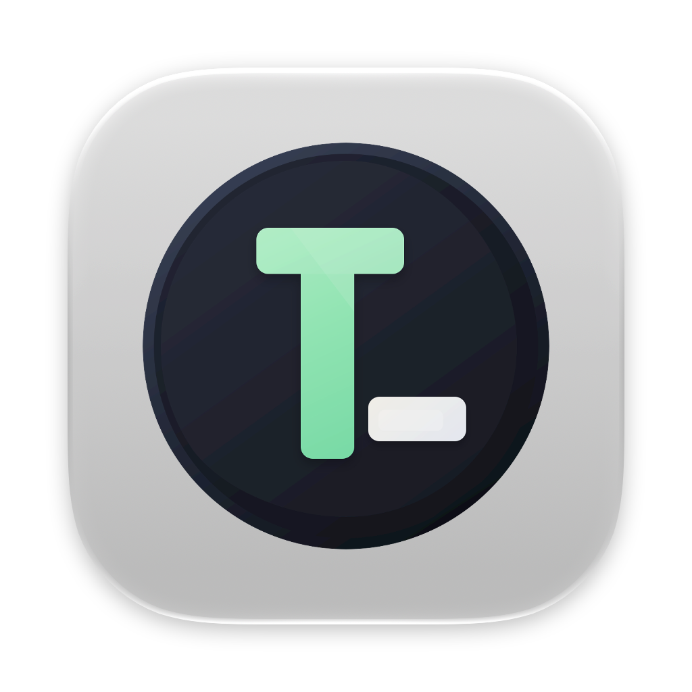

<div align="center">
  <a href="https://github.com/iTsawaysu/XTools">
    
  </a>
  <h1>XTools</h1>
  <p><em>A quiet, native macOS developer toolbox. Fast, local-first, and keyboard-driven.</em></p>

  <p>
    <a href="https://github.com/iTsawaysu/XTools/releases"></a>
    <a href="https://github.com/iTsawaysu/XTools/stargazers"></a>
    <a href="LICENSE"></a>
    
    
  </p>
</div>

## Why

Developers constantly run into small, recurring tasks: formatting JSON, converting timestamps, decoding Base64, testing regexes, generating UUIDs, or inspecting HTTP status codes.

Opening browser tabs is tedious and leaks sensitive data (tokens, configs, keys) to third-party servers. Cross-platform Electron utilities eat gigabytes of RAM and take seconds to boot.

XTools packs 46 essential developer utilities into a single native macOS application. It runs completely offline, opens in milliseconds, and stays out of your way until you summon it via `Cmd + K`.

## Quick Start

### 1. Download DMG (Recommended)

Download the latest DMG from [GitHub Releases](https://github.com/iTsawaysu/XTools/releases/latest), open it, and drag XTools into `Applications`. Supports macOS 13.0+ on Apple Silicon and Intel.

### 2. Build from Source

```bash
git clone https://github.com/iTsawaysu/XTools.git
cd XTools
./build.sh           # Incremental debug build & open app
./build.sh release   # Production release build
swift test           # Run automated test suite
```

## Features

- **Swift 6 Native**: Built purely with SwiftUI and AppKit. Uses tens of megabytes of memory with near-instant cold launch and smooth animations.
- **100% Local-First**: Cryptography, hashing, regex evaluation, and image processing execute entirely on-device. Zero telemetry, zero cloud tracking.
- **Keyboard-First**: Press `Cmd + K` anywhere for fuzzy search across all tools. Use `Cmd + 1` through `Cmd + 7` to switch categories, and `Cmd + Return` to run actions.
- **Linear Design System**: Disciplined dark surface ladder anchored on warm Clay, subtle hairlines instead of heavy shadows, and monospaced typography reserved for data.
- **46 Built-in Utilities**: Curated essentials across conversions, cryptography, developer tools, Web debugging, image handling, time math, and system inspectors.
- **Decoupled Engine**: Core algorithmic logic lives in `XToolsCore`, backed by over 1,700 unit tests.

## Tool Catalog

| Category | Tools |
| :--- | :--- |
| **Converters (8)** | Base64 File, Base64 String, URL Encoder/Decoder, ASCII & Binary, Unicode Converter, Base Converter, Roman Numerals, Case Converter |
| **Crypto & Generators (6)** | Hash Text (MD5, SHA-1/256/512), AES Text Encryption, String Obfuscator, Token Generator, UUID Generator, Password Generator |
| **Development (12)** | JSON Formatter, SQL Prettifier, XML Formatter, YAML Formatter, JSON Diff, Text Diff, Regex Tester, Docker Run → Compose, HTML → Markdown, Crontab Generator, Random Port, Chmod Calculator |
| **Web (5)** | JWT Parser & Signer, Basic Auth Generator, HTTP Status Codes, User-Agent Parser, Keycode Inspector |
| **Image & Color (6)** | Image Format Converter (PNG, JPEG, WebP), Smart Compressor, Watermark, Grayscale Generator, Favicon Suite Generator, Color Converter (HEX, RGB, HSL) |
| **Time & Date (4)** | Unix Timestamp Converter (s/ms), Timezone Viewer, Date Calculator, Chronometer & Stopwatch |
| **Utilities (5)** | Device & Hardware Info, MIME File Type Detector, Math Evaluator, Text Statistics, Emoji & Symbol Catalog |

## Shortcuts

| Shortcut | Action | Description |
| :--- | :--- | :--- |
| `Cmd + K` | **Command Palette** | Global search across all 46 tools and commands |
| `Cmd + 0` | **Workbench** | Return to dashboard with recent and favorite tools |
| `Cmd + 1` – `Cmd + 7` | **Switch Category** | Jump directly to any tool category |
| `Cmd + F` | **Filter Sidebar** | Focus the sidebar search filter |
| `Cmd + B` | **Toggle Sidebar** | Expand to full-width distraction-free workspace |
| `Cmd + Return` | **Primary Action** | Run format, generate, encrypt, or convert |
| `Cmd + ,` | **Preferences** | Toggle appearance, workbench cards, and settings |
| `Esc` | **Dismiss** | Close command palette or reset current focus |

## Contributing

Contributions, bug reports, and tool suggestions are welcome!

1. Fork the repository and create your feature branch.
2. Follow the established code style and keep core algorithms inside `XToolsCore`.
3. Run `swift test` before submitting to ensure all tests pass.

## License

[XTools](https://github.com/iTsawaysu/XTools) is released under the [MIT License](LICENSE).
